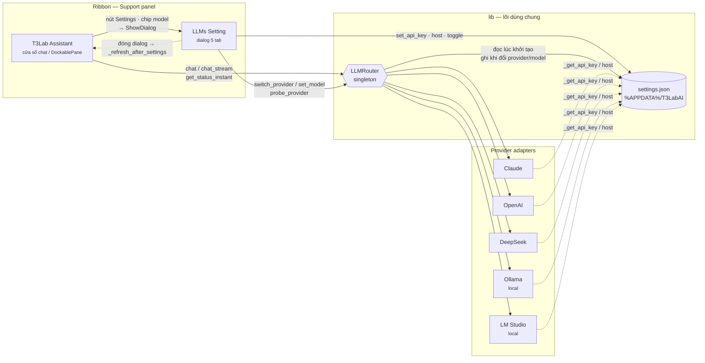
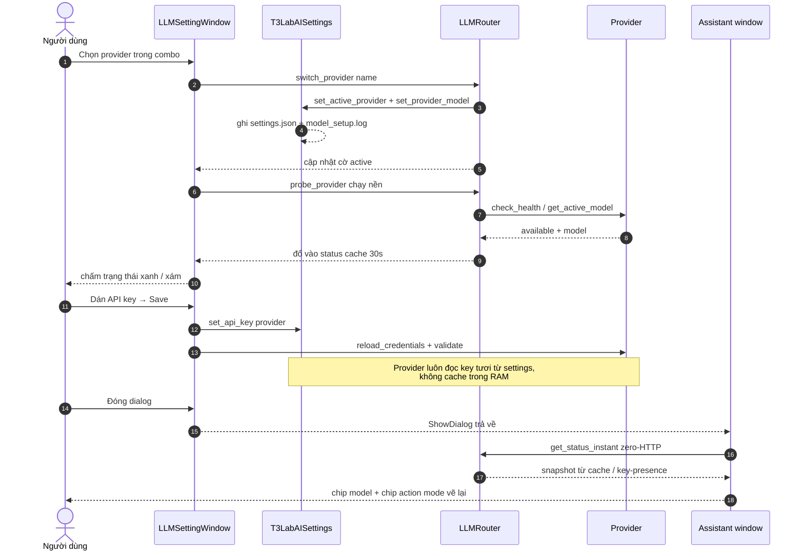
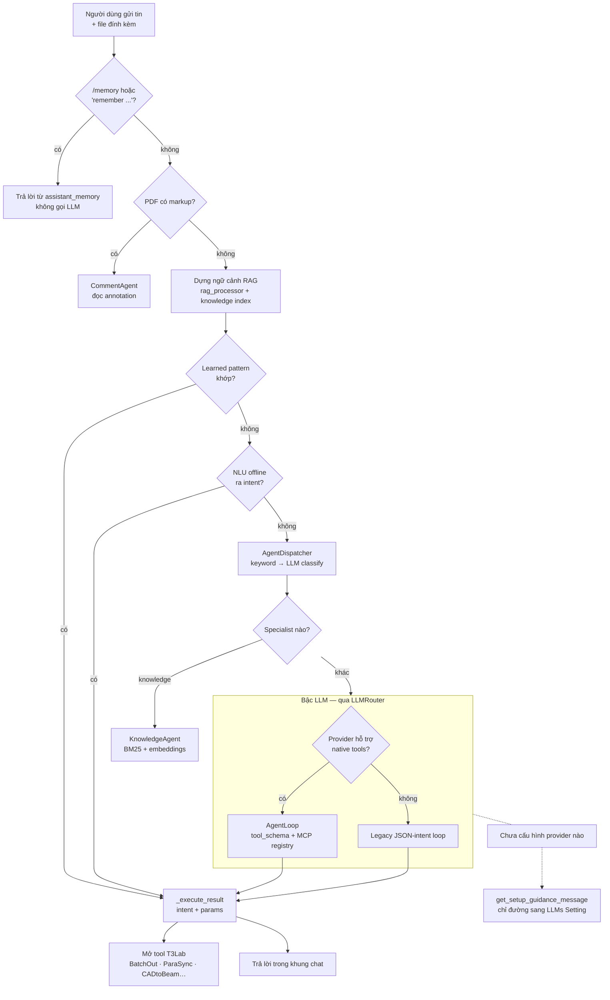
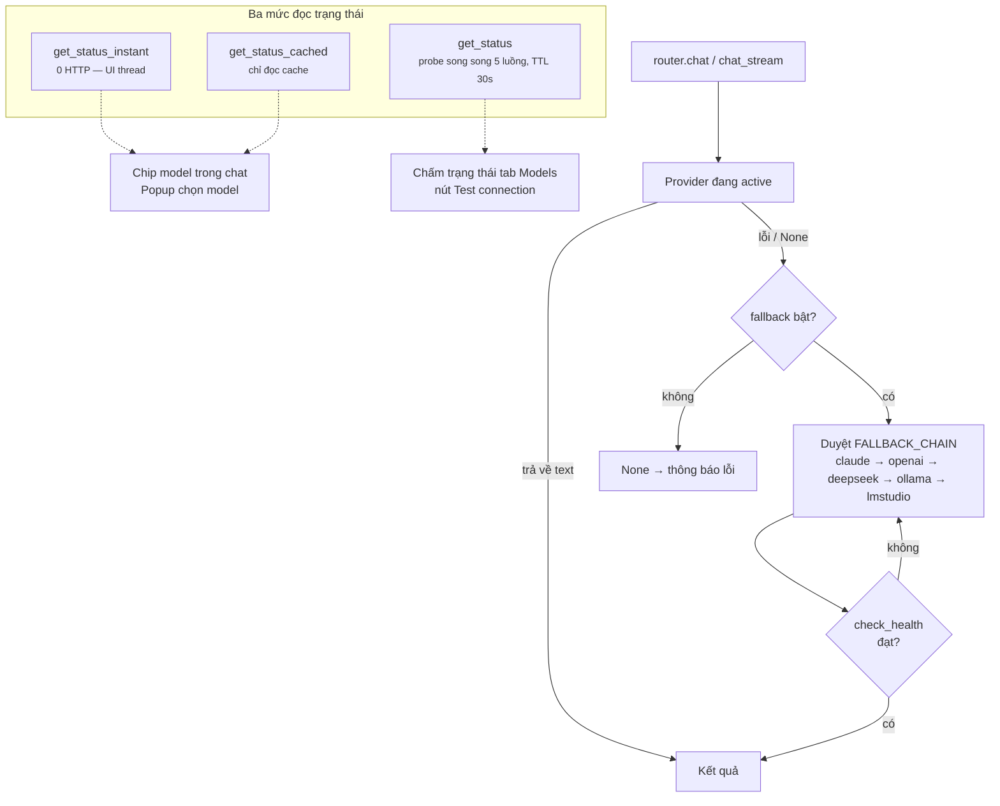

# T3Lab Assistant × LLMs Setting — Sơ đồ luồng liên kết

Hai pushbutton tách rời trên ribbon (`Support.panel`), nhưng dùng chung đúng hai thứ:

| Thành phần | Đường dẫn |
|------------|-----------|
| T3Lab Assistant | `T3Lab.extension/T3Lab.tab/Support.panel/T3LabAssistant.pushbutton/script.py` |
| LLMs Setting | `T3Lab.extension/T3Lab.tab/Support.panel/Assistant Tools.stack/LLMsSetting.pushbutton/script.py` → `lib/GUI/LLMSettingDialog.py` |
| Router (singleton) | `T3Lab.extension/lib/Intelligence/llm_router.py` |
| Cấu hình bền vững | `T3Lab.extension/lib/config/settings.py` → `%APPDATA%\T3LabAI\settings.json` |

Không có tham chiếu trực tiếp nào khác giữa hai UI này.

---

## D-01 · Sơ đồ liên kết tổng thể

**Ba mối nối:**

1. **Qua RAM — `LLMRouter`**: singleton chung tiến trình Revit. Setting đổi provider là Assistant thấy ngay ở lần chat kế tiếp, không cần restart.
2. **Qua đĩa — `settings.json`**: `api_keys`, `active_provider`, `model_preferences`. Router đọc lại khi dựng singleton (`_restore_settings`).
3. **Qua UI — modal + refresh**: Assistant mở dialog bằng `ShowDialog()`; dialog đóng thì `_refresh_after_settings()` vẽ lại chip model, chip action mode và lời chào.

---

## D-02 · Đổi provider / model — đường đi của một lần bấm

**Chiều ngược lại** — chip model trong khung soạn tin của Assistant mở popup dựng từ
`get_status_instant()` (chỉ liệt kê provider đã sẵn sàng). Chọn một dòng →
`_switch_provider()` → cùng `LLMRouter.switch_provider()` mà dialog dùng, nên lựa chọn
này cũng ghi xuống `settings.json`. Dòng cuối popup "Configure API key & model…" gọi
`_open_llm_settings()`, khép vòng.

---

## D-03 · Một tin nhắn đi qua thang định tuyến

`_route_input()` chạy trên worker thread — LLM chỉ là bậc cuối.

Ghi chú: bậc tất định (memory, learned pattern, NLU) chạy được cả khi không có API key.
Bậc fast-context answer đang tắt (`_FAST_CONTEXT_ENABLED = False`).

---

## D-04 · Fallback & trạng thái sức khỏe provider

- Probe chạy song song → tổng thời gian bằng provider chậm nhất, không phải tổng.
- Ollama / LM Studio luôn báo "chưa sẵn sàng" trong snapshot instant cho tới khi probe thật (cần port probe).
- UI thread không bao giờ gọi `get_status()` (có mạng) — từng làm treo Revit khi mở LLMs Setting.

---

## settings.json — ai ghi, ai đọc

| Khoá | Ghi bởi | Đọc bởi | Ảnh hưởng |
|------|---------|---------|-----------|
| `api_keys` | Setting · Onboarding | Provider adapters | Quyết định provider có "available" hay không |
| `active_provider` | Setting · chip model · Onboarding | `LLMRouter._restore_settings` | Provider mặc định khi mở Revit lần sau. **Seed lần đầu = `ollama`** (Qwen local, riêng tư + zero API cost); lựa chọn đã lưu vẫn thắng, fallback chain vẫn với tới cloud khi Ollama chưa sẵn sàng |
| `model_preferences` | Setting (Save model) | Router + `get_status_instant` | Model hiển thị trên chip khi chưa probe |
| `Ollama_Host` · `LMStudio_Host` | Setting (tab Models) | Local provider adapters | Địa chỉ engine cục bộ |
| `username` | Setting (tab General) | Assistant — lời chào | `_update_welcome_greeting` |
| `agents.*` · `action_mode` | Setting (tab General) | Dispatcher + Assistant | Multi-agent, LLM classify, quality mode, auto/confirm |
| knowledge dirs | Setting (tab Knowledge) | `knowledge_store` · RAG | Kho tài liệu được index |
| `disabled_skills` | Setting (tab Skills) | `SkillsEngine` | Skill nào hiện trong popup dấu `/` |
| `active_project` | Setting (tab Projects) · chip project | Assistant + context digest | Instruction, memory, file ngữ cảnh của workspace |

Mọi setter đều reload từ đĩa trước khi ghi; file hỏng bị cách ly thành
`settings.corrupt-<stamp>.json` thay vì bị ghi đè — nếu không, một lần bật/tắt toggle
có thể xoá sạch API key.

---

© Copyright by T3Lab
